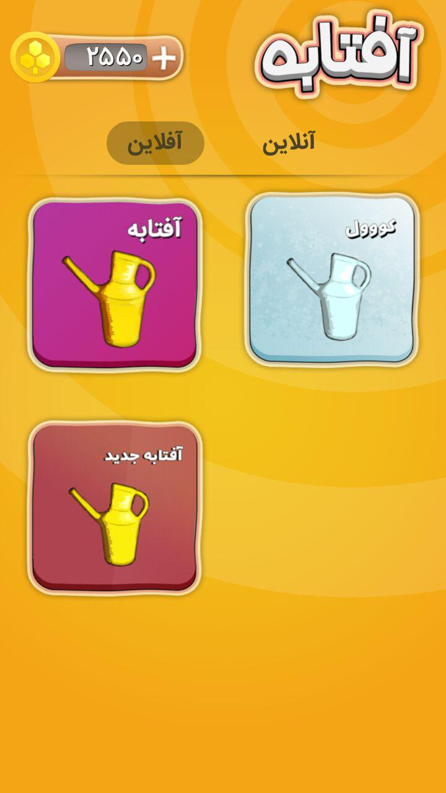
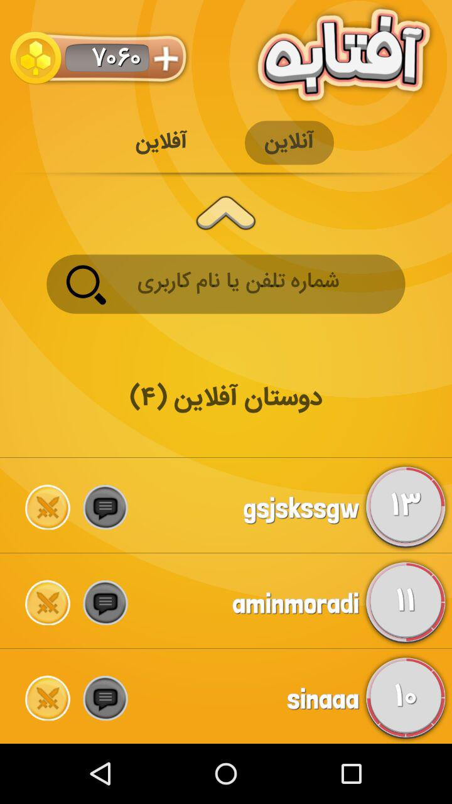
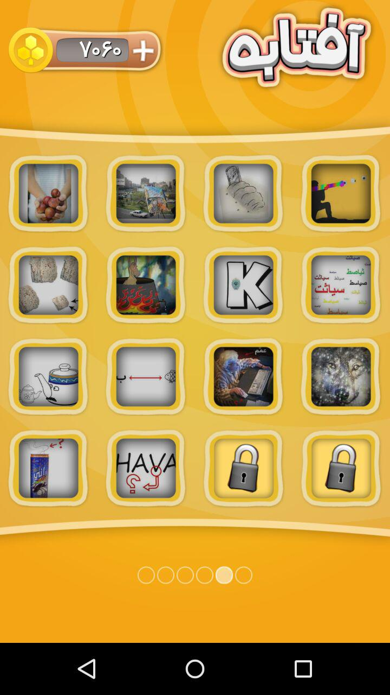
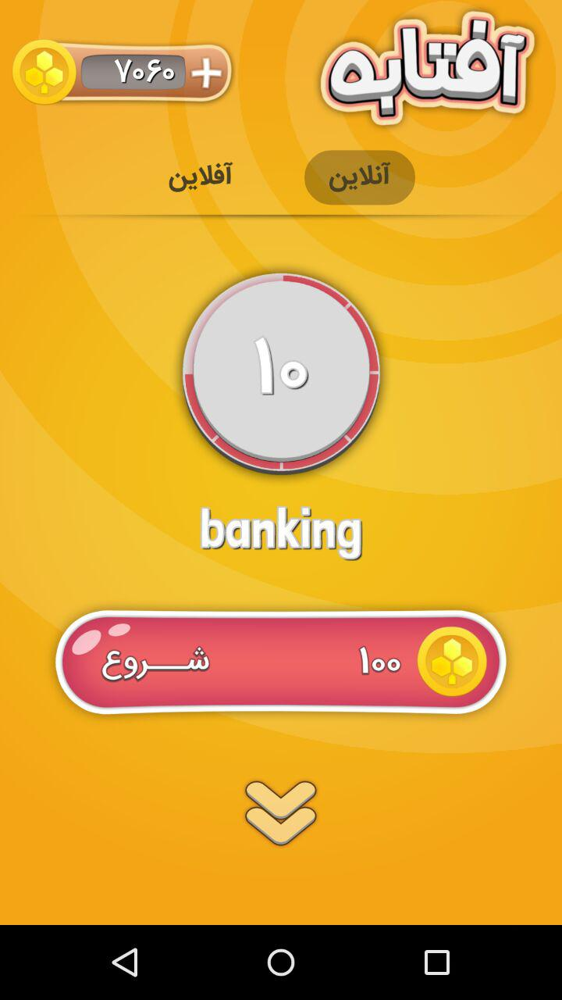
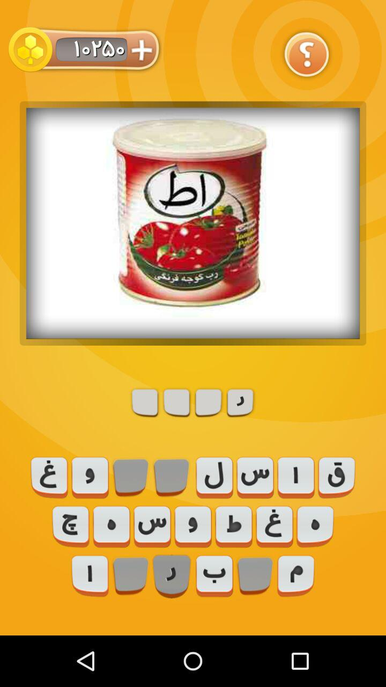

# Guess The Picture - Android

this is a guess based puzzle game . there is a hidden answer in picture. player wins by guessing easter egg in the picture.

### Features :
 * Integrated with Fabric (Analytics and Crash reporter).
 * 98% Crash Free Users
 * Integrated with Google Sign in and SMS based Sign in .
 * Friends, Registration and lots more implemented with Retrofit API.
 * Online 1vs1 implemented with SocketIO
 * Level Packages are addable , changeable and giving special offer to buy from server.
 * Push Notification with GCM , Push Notification Custom Style
 * Encrypted coin system
 * And more :)  

 ## Demo :
 [video demo](doc_2016-09-21_22-07-33.mp4)
#### Screenshots

## License
### "THE BEERWARE LICENSE" (Revision 42):

  <ilaimihar@gmail.com> wrote this code. As long as you retain this
  notice, you can do whatever you want with this stuff. If we
  meet someday, and you think this stuff is worth it, you can buy me a beer in return. -Ali Rahimi
